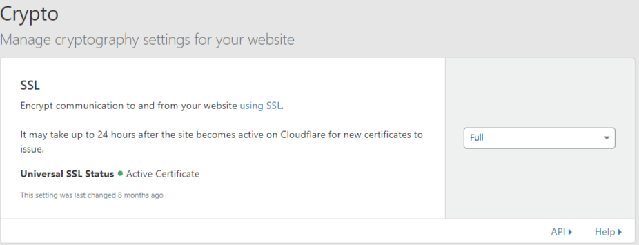
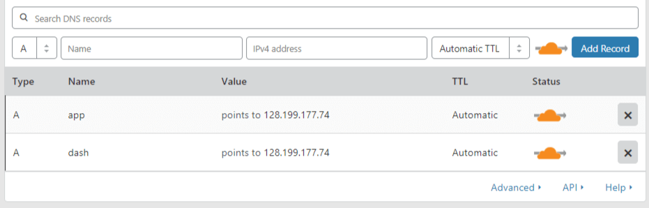
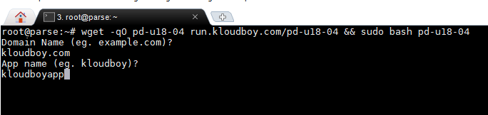

# How To Run Parse Server and Parse Dashboard on Ubuntu 18.04
> This bash script is that fastest way to install Parse Server and Parse Dashboard on your server.
## Use only on Ubuntu 18.04.1 LTS (Bionic Beaver)


## Installation & Usage

## Step 1
Add your domain to [cloudflare](https://www.cloudflare.com/)

## Step 2


Activate FULL SSL.

## Step 3


add 2 sub-domains with your VPS ip A record.
app.yourdomain.com
dash.yourdomain.com

## Step 4
ssh login to your vps (root)

paste below code and press ENTER.

```sh
wget -qO pd-u18-04 run.kloudboy.com/pd-u18-04 && sudo bash pd-u18-04
```
## Step 5


it will ask you your domain name and app name then press ENTER.

## Step 6
the Installation will start. after sometime you need to fill or press Enter in SSL certificate generator.

## Step 7


After successful Installation your Credentials shows (take a copy to notepad and save it.).
you can login to Parse Dashboard. https://dash.yourdomain.com (username is admin)

## Features

> parse-server@3.1.3

> parse-dashboard@1.2.0

> mongodb-runner@4.7.1

> Nginx (updated)

> Node js v11.7.0

> pm2@3.2.9

> Cloudflare Full SSL

## Author

Bajpan Gosh – [@bajpangosh](https://twitter.com/bajpangosh) – bajpan@kloudboy.com

I'm a freelancer living in Kerala, India. I mostly do server administration, bash stuffs and love them

Currently I'm making lots of easy install bash scripts, web tools, websites and apps to help people solve problems, if you enjoy my works please consider making a donation 💕. My ultimate goal is to become a full-time open-source ninja.

[](https://ko-fi.com/O4O41E4TQ)

[](https://www.paypal.me/bajpangosh)

## NEED HELP?

A team of dedicated Cloud Server Administrators assures 24/7 availability of experts for all levels of your server management requirements.

I'd be glad to help you if you have any questions relating to this script. No guarantees, but I'll do my best to assist.

Support via Facebook, Twitter, Email @ Ticket

email    :-support@kloudboy.com

facebook :- https://m.me/TeamKloudBoy

twitter  :- https://twitter.com/TeamKloudBoy

ticket   :-https://kloudboy.freshdesk.com/support/home

https://kloudboy.com/

## Thanks

Your boy, KLOUDBOY.💕
